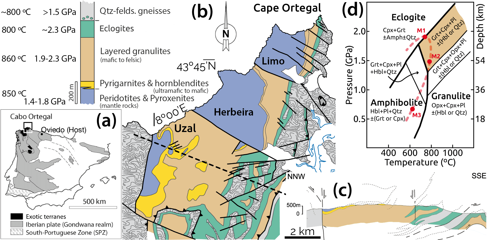

_Website by [Marco A. Lopez-Sanchez](https://marcoalopez.github.io/) - Last update: 2022/02/02_

**The OUTCROP project at a glance**

> The OUTCROP project stands for
>
>_From the L**o**wer Cr**u**st to the man**t**le: elasti**c** p**r**operties, anisotropy, and water c**o**ntent of the Cabo Ortegal com**p**lex_
>
>This is a research project funded by a Margarita Salas ESTABILIZACIÓN grant from the [PCTI-Asturias](http://www.ficyt.es/pcti/index.asp) (Spain) started in December 2021 and led by Marco A. Lopez-Sanchez (PI) at [Uniovi](https://www.uniovi.es/en/inicio). We aim to determine the average seismic properties (wavespeeds & anisotropy) and water content of a volcanic arc root section (lower crust and mantle), a key building block in the formation of the continental crust where these parameters are not well constrained. To estimate seismic wavespeeds and anisotropy, we will use a two-step method, making direct measurements on rocks exhumed from the lower crust and lithospheric mantle, and then modelling the average rock properties at depth (a.k.a. the rock & fabric-recipe approach). For water tracing, we will use [FTIR](https://en.wikipedia.org/wiki/Fourier-transform_infrared_spectroscopy) and, in a pioneering way, [LIBS](https://en.wikipedia.org/wiki/Laser-induced_breakdown_spectroscopy) spectroscopy on nominally anhydrous minerals (NAMs). The core team is shared between the University of Oviedo (Asturias, Spain) and the IACT-CSIC in Granada (Spain) with collaborations from Geosciences Montpellier (France) and the University of Málaga (Spain).

[TOC]

## Why the OUTCROP project?

The lower crust has become the focus of recent attention as we now better understand that its properties are relevant to understand earth dynamics, the chemical origin of rocks, the assembly of continental crust, the role of fluids at depths, and seismology (e.g. achieve high-resolution images of the lithosphere)1,2,3,4,5. The lower crust of subcontinental and transitional tectonic plates is, however, the lesser-known section of the "rigid" outer layer of the Earth known as the lithosphere. Located at depths of ~15-40 km, beyond the current drilling limit, only indirect methods such as geophysical surveys probe the present-day lithosphere's structure (radial and lateral) at such depths. However, achieving high-resolution images and composition of the depth lithosphere from seismic or magneto-telluric data requires precise knowledge of density, elastic properties, and water content of rocks at those depths. We aim to limit these rock properties in a quite particular tectonic environment, a volcanic arc root section. These tectonic areas are of great interest to earth scientist for a variety of reasons but the two main ones are...TODO crust-mantle boundary, the Moho, 

To estimate what average physical properties characterise the rocks at these still inaccessible depths and to solve this puzzle, Earth scientists usually study exhumed portions of the lower crust, known as granulite terrains, and mantle brought to the surface during tectonic events. However, the presence of such rocks at the Earth’s surface is limited and scattered worldwide. In turn, these terrains always raise the question as to whether the rocks observed at the present surface are representative of those once resided at deep (> 0.6 GPa); i.e. if the exhuming process might induce important chemical and/or physical changes. Another desirable feature to find in such deep exhumed terrains is the crust-mantle transition (Mohoroviĉić discontinuity or *Moho*), a first-order sharp seismic discontinuity in the Earth (VP increases from ~7 to 8 km s-1) with broad implications for lithospheric strength models and seismic interpretation. The presence of the *Moho* in situ is rare for continental or transitional granulite sections. A granulite terrain with exceptional qualities for determining seismic properties should meet the following criteria: (1) allow a systematic study of their properties (fairly good rock exposure), (2) include the crust-mantle transition, and (3) allows reconstruction of its properties over time (i.e. mineral/microstructure changes over time are easily identifiable). **Determine the typical seismic properties and water content of a granulite terrain that has these features and gaining knowledge on how these vary with mineralogical changes caused by their tectonic evolution is a central goal of the OUTCROP project**.

**Water content** affects several physical properties of rocks: melting temperature, rheology, diffusion, elastic/seismic properties, and electrical conductivity. It is also key for a correct estimate of *P* and *T* based on thermodynamic modelling (i.e. water fugacity). At depths below 15 km, water is mostly contained within hydrous minerals, such as mica and amphibole, that become unstable at the elevated *P* and *T* typical of the lower crust. Indeed, the continental lower crust and the mantle are generally considered dry (i.e. no free fluids at phase boundaries). During exhumation, water-unsaturated rocks react with any available water to produce hydrous minerals that may obscure the hydrated or dry nature of the pristine rock. The determination of trace amounts of water (OH & H) in the crystalline structure of persistent nominally anhydrous minerals (NAMs) is the only gateway to prove the existence of water at these depths, provided that NAMs behave as closed systems during exhumation. Despite this, the water content in the lower crust remains highly unconstrained due to measurement limitations in NAMs: low water content and FTIR orientation biases caused by the high anisotropy of most minerals forming the lower crust. **We also aim to develop new procedures to overcome these limitations within the project.**

In a nutshell, with the OUTCROP project we will be able to answer questions that have direct applications for geophysicists (modelling the state of deformation and strain rates in the lithosphere), seismologists (e.g. infer composition & structure from seismic data) and petrologists (understanding the processes that make up the lithosphere), and boost the state of the art of different techniques that serve to constrain seismic anisotropy and water content of deep rocks.

## How will we do it?

The project is subdivided into five work packages summarized and linked in figure 1.

Figure 1. *Synoptic board summarizing the research methodology, general and specific goals (“work packages”), and their links.*

Seismic properties of deep rocks (> 15 km) can be measured using two approaches: direct laboratory measurements using high-temperature (*HT*) high-pressure (*HP*) devices or calculated from mineral content and rock microstructure (i.e. modelling). Laboratory measurements are challenging. First, the number of measures allowed is usually fewer than that required to characterize the full elastic tensor that allows estimating the seismic wave speeds in any direction and, thus, the full anisotropy. Second, the range in applied *P* and *T* does not cover the conditions at the lower crust and mantle, e.g. *P* are usually limited to <0.5 GPa (lower crust >0.6 GPa) and only room *T* applies for setups that allow restoring the full elastic tensor. The confining pressure is a key factor because at high pressures the bulk rock density and the crystal preferred orientation (CPO) of anisotropic minerals control the elastic properties and seismic anisotropy at dry conditions. Another main limitation is the tiny size of the sample required by high-pressure devices that often prevent representative measurements in the laboratory, especially for the lower crust and mantle rocks where the grain size is usually in (or close to) the centimetre range. At *P* above ~0.6 GPa, seismic wave speeds are no longer influenced by extrinsic factors such as microcracks and pores[8,9]() and this makes the approach based on modelling the most suitable for the study case, where pressures exceeded 1.0 GPa (Fig 2).

### The target section

**Figure 2.** *(a) Location of the Cabo Ortegal complex. (b) Geological map of the HP-HT units showing the rock sequence and peak P-T conditions. (c) Geological cross-section along the Uzal massif. (d) Simplified P-T grid with eclogite, granulite and amphibolite facies for Si-rich mafic compositions. Coloured field corresponds to the HP granulites stability field. Mineral content in equilibrium listed in each field. The metamorphic path and events of the HP rocks are in red.*

## Publications

Available soon

### Codes released

Available soon

### Datasets & multimedia content

Available soon

## Personnel

---

Copyright © 2022 Marco A. Lopez-Sanchez  

_Information presented on this website is provided without any express or implied warranty and may include technical inaccuracies or typing errors; the author reserve the right to modify or enhance the content of this website at any time without previous notice. This webpage is not liable for the content of external links._  

_Website hosted on GitHub Pages — Created with [Typora](https://typora.io/)_  