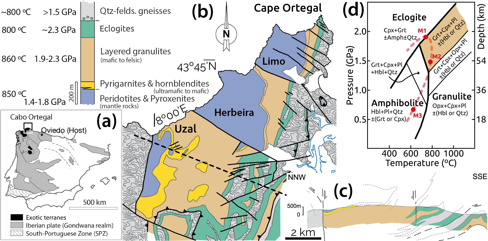

_Website by [Marco A. Lopez-Sanchez](https://marcoalopez.github.io/) - Last update: 2022/02/21_

**The OUTCROP project at a glance**

> The OUTCROP project stands for
>
>_From the L**o**wer Cr**u**st to the man**t**le: elasti**c** p**r**operties, anisotropy, and water c**o**ntent of the Cabo Ortegal com**p**lex_
>
>This is a research project funded by a Margarita Salas ESTABILIZACIÓN grant from the [PCTI-Asturias](http://www.ficyt.es/pcti/index.asp) (Spain) started in December 2021 and led by Marco A. Lopez-Sanchez (PI) at the [University of Oviedo](https://www.uniovi.es/en/inicio). We aim to determine the average seismic properties (wave speeds & anisotropy) and water content of a volcanic arc root section (lower crust and mantle), a key building block in the assembly of the continental crust where these parameters are not well constrained. To determine the seismic properties, we use a two-step approach combining direct measurements on rocks exhumed from the lower crust and the lithospheric mantle and determining average rock properties at depth from model rocks using thermodynamic equilibrium modelling. For water tracing, we will use [FTIR](https://en.wikipedia.org/wiki/Fourier-transform_infrared_spectroscopy) and, in a pioneering way, [LIBS](https://en.wikipedia.org/wiki/Laser-induced_breakdown_spectroscopy) spectroscopy on nominally anhydrous minerals (NAMs). The core team is shared between the University of Oviedo (Asturias, Spain) and the IACT-CSIC in Granada (Spain) with collaborations from Geosciences Montpellier (France) and the University of Málaga (Spain).

[TOC]

## Why the OUTCROP project?

The lower crust has become the focus of recent attention as we now better understand that its properties are relevant to understand [earth dynamics](https://doi.org/10.1146/annurev.earth.36.031207.124326), the [chemical origin of crustal rocks](https://doi.org/10.1029/95RG01302), the [assembly of the continental crust](https://doi.org/10.1038/srep33517), the role of [fluids at depths](https://doi.org/10.1146/annurev-earth-060614-105224), and [seismology](https://doi.org/10.1146/annurev-earth-050212-124117) (e.g. achieve high-resolution images of the lithosphere). The lower crust of subcontinental and transitional tectonic plates is, however, the lesser-known section of the "rigid" outer layer of the Earth known as the lithosphere. Located at depths of ~15-40 km, beyond the current drilling limit, only indirect methods such as geophysical surveys probe the present-day lithosphere's structure (radial and lateral) at such depths. Achieving high-resolution images and composition of the depth lithosphere from seismic or magneto-telluric data requires precise knowledge of rock properties such as density, wave speeds and anisotropy or water content at those depths. We aim to determine these properties in a quite particular tectonic environment, a volcanic arc root section, where these parameters are not well constrained. 

Although there is no technology yet capable of making direct measurements at lower crust/mantle depths, Earth scientists can explore these properties on deep rocks brought to the surface during tectonic and volcanic processes. For example, rock fragments exhumed during volcanic eruptions (xenoliths) or portions of the lower crust (granulitic terrains) and mantle brought to the surface during tectonic events. Xenoliths pose clear limitations as they provide no information on the lithosphere structure and tend to under-represent some lithology types. Granulite terrains provide information about how the properties of depth rocks vary radially and laterally in a limited portion of the lithosphere and although the presence of such terranes at the Earth’s surface is limited and scattered worldwide are more ideal for this task. Some limitations of these terrains are that they always raise the question as to whether the rocks observed at the present surface are representative of those once resided at deep, where pressure exceeded 0.6 GPa. Thus, the exhuming process might induce important chemical and/or physical changes in the rocks modifying their original properties. Another desirable feature to find in such terrains is the crust-mantle transition (i.e. the Mohoroviĉić or *Moho* discontinuity), a first-order sharp seismic discontinuity in the Earth where the P-wave speed increases from ~7 to 8 km s-1 with broad implications for lithospheric strength models and seismic interpretation. The presence of the Moho in place is, however, rare for continental or transitional granulite sections. A granulite terrain with exceptional qualities for determining seismic properties should meet the following criteria: (1) allow a systematic study of their properties (fairly good rock exposure), (2) include the crust-mantle transition, and (3) allows reconstruction of its properties over time (i.e. mineral/microstructure changes induced by the exhumation process are easily identifiable).

**Water content** affects several physical properties of rocks such as melting temperature, rheology, diffusion, elastic/seismic properties, and electrical conductivity. It is also key for a correct estimate of *P* and *T* based on thermodynamic modelling (i.e. water fugacity). At depths below 15 km, water is mostly contained within hydrous minerals, such as mica and amphibole, that become unstable at the elevated pressures and temperatures typical of the lower crust. Indeed, the continental lower crust and mantle are generally considered dry (i.e. no free fluids at phase boundaries). During exhumation, water-unsaturated rocks react with any available water to produce hydrous minerals that may obscure the hydrated or dry nature of the pristine rock at depth. The determination of trace amounts of water (OH & H) in the crystalline structure of persistent nominally anhydrous minerals (NAMs) is the only gateway to prove the existence of water at these depths, provided that NAMs behave as closed systems during exhumation. Despite having this option available, the water content in the lower crust remains highly unconstrained due to measurement limitations in NAMs: their low water content and FTIR orientation biases caused by the high anisotropy of most minerals forming the lower crust. **We aim to develop new procedures to overcome these limitations within the project.**

In a nutshell, **the central goal of the OUTCROP project is to determine the typical seismic properties and water content of a volcanic arc root section using an exhumed granulite and mantle section with exceptional features**. Average rock properties will be determined by combining direct measurements in rock samples, the radial and lateral distribution of these properties within the terrane, and thermodynamic equilibrium modelling. With this knowledge, we will be able to answer questions that have direct applications for geophysicists (modelling the state of deformation and strain rates in the lithosphere), seismologists (e.g. infer composition & structure from seismic data, how mineralogical changes and reaction fronts affect the seismic response) and petrologists (understanding the processes that make up the lithosphere), and boost the state of the art of different techniques that serve to constrain seismic anisotropy and water content of deep rocks.

## How will we do it?

The project is subdivided into five work packages summarized in figure 1 below.

Figure 1. *Synoptic board summarizing the research methodology, general and specific goals (“work packages”), and their links.*

Seismic properties of deep rocks (> 15 km) can be measured using two approaches: direct laboratory measurements using high-temperature and high-pressure devices or calculated from mineral content and rock microstructure using averaging schemes (i.e. modelling). Laboratory measurements are challenging. First, the number of measures allowed are usually fewer than that required to characterize the full elastic tensor that allows estimating the seismic wave speeds in any direction and, thus, the anisotropy. Second, the range in applied *P* and *T* does not cover the conditions at the lower crust and mantle, e.g. pressures are usually limited to < 0.5 GPa (lower crust > 0.6 GPa) and only room temperatures apply for setups that allow restoring the full elastic tensor. The confining pressure is a key factor because at high pressures the bulk rock density and the crystal preferred orientation (CPO) of anisotropic minerals mainly control the elastic properties and seismic anisotropy. Another main limitation of the laboratory approach is the tiny size (millimetre scale) of the sample required by high-pressure devices that often prevent representative measurements, especially for the lower crust and mantle rocks where the grain size is usually in (or close to) the centimetre range. At pressures above ~0.6 GPa, seismic wave speeds are [no longer influenced by extrinsic factors such as microcracks and pores](https://doi.org/10.1029/JB079i002p00407) (the high confining pressures cause pores/cracks to collapse) and this makes the approach based on modelling the most suitable for the study case, where confining pressures exceeded 1.0 GPa (see Fig 2).

To **determine the seismic properties**, we use a two-step approach combining direct measurements on the exhumed lower crust and lithospheric mantle rocks and modelling the average rock seismic properties at depth. This approach requires three different work packages (WPs 2, 3 and 4 in figure 1). First, measure the crystallographic orientation of all the major mineral phases that make up the rocks by making wide-coverage orientation maps with the electron-backscatter (EBSD) technique (WP2). Second, to establish the modal proportions of the different minerals and thus the density of the rocks lying at these depths and different stages of their evolution. For this, we will combine different techniques and use the [Perple_X software](https://www.perplex.ethz.ch/) for thermodynamic modelling. Finally, by making a joint analysis of the crystallographic orientation data, thermodynamic equilibrium, and the distribution of the different rocks to apply different seismic property averaging schemes. We will do this using the MTEX toolbox and our codes.

We also aim to determine **water content in persistent nominally anhydrous minerals or NAMs** using three spectroscopy methods: [Fourier Transform Infrared (FTIR) spectroscopy](https://serc.carleton.edu/NAGTWorkshops/mineralogy/mineral_physics/raman_ir.html), [RAMAN spectroscopy](https://en.wikipedia.org/wiki/Raman_spectroscopy), and [Laser-induced breakdown (LIBS) spectroscopy](https://en.wikipedia.org/wiki/Laser-induced_breakdown_spectroscopy). The determination of trace amounts of water (hydroxyl & hydrogen) in NAMs is challenging due to measurement difficulties with traditional FTIR. First, due to the low water content of common NAMs that have an H₂O-carrying capacity of ~100-1000 _ppm_, and second, because FTIR but also RAMAN spectroscopy have orientation biases caused by the high anisotropy of most NAMs forming the lower crust (i.e. the signal depends partly on the crystallographic orientation of the characterised mineral). To overcome these limitations, we propose to combine the use of crystallographic orientation mapping using EBSD and FTIR and RAMAN measurements coupled with the development of free and open-source codes for the processing of these data considering the orientation bias. Besides, we will also explore the pioneering use of LIBS spectroscopy, an all-optical spot analysis spectroscopy method unaffected by the orientation bias, to measure hydrogen content in NAMs. There is a growing interest in refining the LIBS technique for hydrogen/hydroxyl measurement because it allows finding traces of water at the surface of outer planetary systems; e.g. the Mars Perseverance Rover include a LIBS ([ChemCam](https://mars.nasa.gov/mars2020/spacecraft/instruments/supercam/for-scientists/)) instrument to analyse Mars rocks for their H emission signal. We, therefore, want to explore how this technique performs in NAMs compared to FTIR as proof of concept.

### The target section

The [Cabo Ortegal Complex (COC)]() is a well-exposed metamorphic terrane in north-western Spain (Fig. 2a). It includes high-_P_ and high-_T_ rocks surrounded by arc-volcanic and oceanic-derived rocks. The high-_P_ and high-_T_ unit is condensed in a sequence of ~1 km thick that contains four major mappable rock units (Fig. 1b). So far, most studies focused on the geological history of the COC terrane rather than their physical properties with few exceptions ([Brown et al. 2009](http://dx.doi.org/10.1016/j.epsl.2009.05.032); [Llana-Fúnez and Brown, 2012](https://doi.org/10.1130/B30568.1)). The general structure, local composition, deformation/metamorphic sequence, and geochronology is thus fairly known. Petrologic and chemical criteria indicate that the high-_P_ granulites and the underlying mantle rocks belong to a transitional (island-arc root) lower crust section (e.g. [Galán and Marcos, 1997](https://doi.org/10.1007/s005310050162); [Moreno et al., 2001](https://doi.org/10.1144/jgs.158.4.601); [Tilhac et al., 2016](https://doi.org/10.1093/petrology/egw064)). The most striking feature of the COC section, however, is that it exposes a full transitional section from the lower crust upper to the mantle (i.e. the [Moho discontinuity lies in situ](https://doi.org/10.1007/s005310050162)) which is a rare occurrence for a continental or transitional section. The focus on this particular section is twofold: the seismic properties of this type of transitional lithosphere differ significantly from those of the continents (the [Moho appears as a fuzzy discontinuity](https://doi.org/10.1029/95JB00259)) and they have been proposed as [one of the places where the continental Moho can originate](https://doi.org/10.1038/nature12758), hence its major scientific interest in geosciences.

**Figure 2.** *(a) Location of the Cabo Ortegal complex. (b) Geological map of the HP-HT units showing the rock sequence and peak P-T conditions. (c) Geological cross-section along the Uzal massif. (d) Simplified P-T grid with eclogite, granulite and amphibolite facies for Si-rich mafic compositions. Coloured field corresponds to the HP granulites stability field. Mineral content in equilibrium listed in each field. The metamorphic path and events of the HP rocks are in red.*

The COC rock sequence records changes in mineralogy and microstructure due to the exhumation. Peak pressure and temperature conditions, metamorphic events, and mineral assemblages are summarized in figure 2d. Mantle rocks show pervasive [serpentinization](https://en.wikipedia.org/wiki/Serpentinite) with the original microstructure locally preserved. Lower crustal rocks record three major metamorphic events (Fig. 2d). High-_P_ granulites in contact with mantle rocks, referred to as massive granulites, preserve eclogite (high-_P_ high-_T_ rocks) lenses that record the highest pressure conditions (event M1), later transformed into granulites (event M2) characterized by the presence of garnet, clinopyroxene, plagioclase and the lack of orthopyroxene. Above these, i.e. further away from the Moho, there are layered granulites made up of minerals characteristic of more moderate pressures and temperatures (e.g. hornblende) referred to as the metamorphic event M3 induced by the rock exhumation process (Fig. 2d), yet partially preserving the high-_P_ mineral assemblages representing the event M2. Plastic deformation causing the layering and the strong resetting of preferred orientation of the minerals mainly occurred at the transition from M2 to M3 event. Data on water content on NAMs formed during the *high-_P_ high-_T_* metamorphism is yet to be reported. Overall, the local preservation of high-pressure mineral assemblages and microstructure and the state-of-the-art on the general COC metamorphism make these rocks an exceptional target to study how the seismic response varies during exhumation of the lower crust. We will focus the collection of samples on the Uzal area (Fig. 2b), where the lower crust section outcrops with the best conditions and the Moho lies in situ.

## Publications

Available soon

### Codes released

Available soon

### Datasets & multimedia content

Available soon

## Team

**Marco A. Lopez-Sanchez** (PhD in Geology, 2013, Oviedo) is a fixed-term hired researcher at the Department of Geology at the University of Oviedo. He has five years of postdoctoral experience, four of which have been in the *Manteau et Interfaces* research group at Geosciences Montpellier (France) as a CNRS researcher including an MSCA-COFUND grant. Marco is an expert in microstructure and texture (CPO) analysis of solid materials (rocks, minerals, alloys) using  Electron Backscatter Diffraction (EBSD), image analysis and digital image correlation (DIC) techniques, the development of _in situ_ and _ex situ_ experimental methods, and modelling rock elastic properties (e.g. seismic wave speeds and anisotropy). He also has extensive experience in programming (Python, Matlab) and code development for data analysis (https://github.com/marcoalopez). By 2022, he begins a new stage in his career as a researcher in Spain to develop the project OUTCROP as principal investigator.

**Personal website**: https://marcoalopez.github.io/  

**Sergio Llana-Fúnez** (PhD in Geology, 1999, Oviedo) is a lecturer in geodynamics in the Department of Geology at the University of Oviedo expert in rock deformation, crustal structure and tectonics of orogens, and microstructural analysis. After his PhD, Sergio spent nearly ten years in several postdoctoral positions (ETH Zürich, University of Manchester and University of Liverpool) including MSCA and NERC Postdoctoral grants. He returned to Oviedo holding a Ramón y Cajal fellowship in 2009. He led 10 research projects and was the Head of the Department of Geology at the University of Oviedo between 2016 and 2018.  Sergio has published five papers on the Cabo Ortegal complex, two of which are the only existing ones on their seismic properties, several geological field guides of the area, and he is the co-author of a detailed geological map of the Cabo Ortegal complex in 2002.

**Personal website**:  http://orcid.org/0000-0002-8748-5623  

**José A. Padrón-Navarta** (PhD in Geology, 2010, Granada) is a Ramón y Cajal (RyC) research fellow at the IACT-CSIC and a CNRS researcher at Géosciences Montpellier expert in phase equilibria and metamorphism of ultramafic rocks, fluid-rock interactions, and NAMs. After his PhD, he spent nearly four years in several postdoctoral positions (UGR, ANU Research School of Earth Sciences, Geosciences Montpellier) including an MSCA global fellowship. He obtained a full-time researcher position at the CNRS in 2014 (Géosciences Montpellier) and moved to IACT-CSIC in 2020 with an RyC fellowship. Within the OUTCROP project, he leads the FTIR analysis, metamorphic interpretation, and thermodynamic modelling (Perple_X).

**Personal website**:  https://orcid.org/0000-0003-1005-0012

> A broader list of people available soon !  

---

Copyright © 2022 Marco A. Lopez-Sanchez  

_Information presented on this website is provided without any express or implied warranty and may include technical inaccuracies or typing errors; the author reserve the right to modify or enhance the content of this website at any time without previous notice. This webpage is not liable for the content of external links._  

_Website hosted on GitHub Pages — Created with [Typora](https://typora.io/)_  